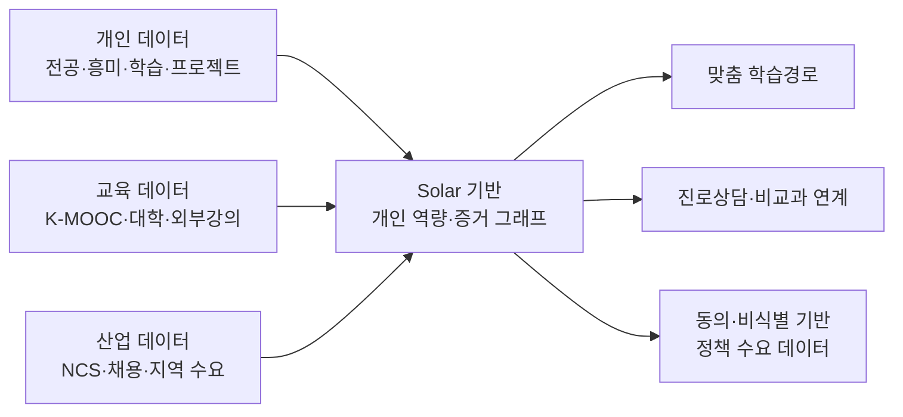

# GapProof 프로젝트 소스북 v0.1

## NotebookLM · 멘토링 · 리부트 AI 활용대회 공동 작업용

- 기준일: 2026-07-22
- 최종 수정 동결: 2026-08-03
- 다음 결정 회의: 2026-07-23 멘토링
- 문서 상태: 멘토링 전 가설과 확인된 사실을 구분한 기준 문서
- 핵심 문장: **공백·전환 경험을 역량 증거로 바꾸는 Solar 기반 AI 진로상담 지원 플랫폼**

> 이 문서는 NotebookLM, Codex, 멘토, 발표자료가 서로 다른 이야기를 만들지 않도록 만든 단일 기준 문서다. `[확정]`, `[근거 있음]`, `[가설]`, `[추론]`, `[결정 필요]`, `[미실행]` 표시를 유지한다.

---

## 0. 30초 요약

노동시장의 직무와 필요한 역량은 AI 발전으로 빠르게 변하지만, 개인이 가진 학적·전공·자격은 정적이다. 전공 밖의 독학, 프로젝트, 아르바이트, 공백 중의 시도는 이력서에서 설명하기 어렵고, 목표직무를 정하고 필요한 학습을 찾아 증거로 만드는 데 큰 에너지가 든다.

GapProof는 이 전환비용을 낮춘다. 사용자가 경험·노트·수료·프로젝트를 넣으면 Solar가 한국어 문맥에서 `역량 후보 + 원문 근거 + 빠진 정보 + 추가질문`을 구조화한다. 사용자가 확인한 항목만 증거등급을 받고, 목표직무와의 격차, 이번 주 행동 3개, 개인용 GapProof 카드, 상담사용 1쪽 Gap Brief로 연결된다.

**핵심 차별점은 강의 추천이 아니라 `경험 → 근거 → 사용자 확인 → 격차 → 행동 → 상담`의 닫힌 흐름이다.**

---

## 1. 첫 번째 그림의 정확한 이름

첫 번째 사진과 같은 그림은 다음 세 표현을 목적에 따라 쓸 수 있다.

1. **서비스 데이터 흐름도(DFD)**: 데이터가 어디에서 들어와 어떻게 처리되고 어디에 쓰이는지 설명할 때 가장 정확한 명칭
2. **GapProof 서비스 개념도**: 심사·발표에서 비전문가에게 보여줄 때 가장 자연스러운 명칭
3. **입력–처리–출력(IPO) 구조도**: PBL의 컴퓨팅 사고 단계와 연결해 설명할 때 적합한 명칭

이 프로젝트에서는 발표 제목을 **“GapProof 서비스 개념도”**, 문서 설명을 **“개인·교육·산업 데이터를 Solar 개인 역량 그래프로 변환하는 데이터 흐름도”**로 쓴다.



MVP에서는 모든 외부기관을 실시간 연동하지 않는다. 개인의 비정형 경험, 수동 큐레이션한 대표 직무 1개, 준비된 학습행동을 이용해 코어 가치만 검증한다.

---

## 2. 일정의 기준과 우선순위

### 2.1 운영 담당자가 직접 안내한 제출 일정 `[확정]`

2026-07-22 전달받은 안내:

> 1차 제출: 7월 29일까지, 필요시 보안 요청  
> 2차 제출: 7월 31일까지, 필요시 보안 요청  
> 최종 제출: 8월 3일까지, 이후 수정 불가  
> 8월 4일 담당자가 취합·정리하여 최종 제출

**운영 원칙:** 대회 포스터의 ‘8월 예선 예정’보다 위 직접 안내를 내부 제작 마감으로 우선한다. 8월 3일 이후 수정 가능하다고 가정하지 않는다.

### 2.2 남은 기간 실행계획

| 날짜 | 반드시 끝낼 것 | 완료 기준 |
|---|---|---|
| 7/22 | 기준문서·PBL v0.1·MVP 명세·클릭 프로토타입 골격 | 멘토가 화면과 문서를 보고 결정 가능 |
| 7/23 | 멘토링 결정 잠금 | 첫 사용자·구매자·대표직무·삭제범위·Solar 기준·제출물 확인 |
| 7/24 | PBL v0.2·5화면 UX·데이터 구조·서비스 개념도 | 구현 중 바꾸지 않을 핵심 흐름 확정 |
| 7/25 | 경험 입력→Solar 구조화→사용자 확인 | 근거가 있는 역량을 확인·수정·거절 가능 |
| 7/26 | 증거등급→격차→행동 3개 | 대표직무 1개에서 결과가 재현됨 |
| 7/27 | GapProof 카드·Gap Brief·동의·삭제 | 핵심 세로 흐름 완성, 내부 테스트 |
| 7/28 | 1차 제출 후보·3명+상담사 1명 빠른 검증 | 로그아웃 실행, 3분 시연, 치명오류 0 |
| 7/29 | **1차 제출** | 링크·설명·보안요청 여부 제출 |
| 7/30 | 피드백 반영·누적 5명+상담사 2명 검증 | 수치와 익명 피드백을 발표 근거로 정리 |
| 7/31 | **2차 제출** | 기능·문장·영상 초안 안정화 |
| 8/1 | README·개인정보 안내·발표자료·3분 영상 | 심사자가 혼자 실행하고 이해 가능 |
| 8/2 | 최종 리허설·링크·수치·보안 감사 | 다른 기기에서 5회 연속 시연 성공 |
| 8/3 | **최종 제출·수정 동결** | 제출물 사본·버전·체크섬 보관 |
| 8/4 | 담당자 취합·최종 제출 | 수정하지 않고 문의에만 대응 |

### 2.3 일정 리스크

- 제출물의 정확한 파일 종류와 영상 길이는 아직 `[결정 필요]`다.
- ‘1차·2차 제출’이 평가용인지 내부 피드백용인지 `[결정 필요]`다.
- 보안 요청의 대상과 방식이 `[결정 필요]`다. 저장소 비공개, 링크 비밀번호, 개인정보 마스킹 중 무엇인지 확인해야 한다.
- 실제 Solar API 연결이 늦어져도 샘플 데모가 실제 호출처럼 보이면 안 된다.

---

## 3. 문제와 사회적 맥락

### 3.1 해결하려는 핵심 문제 `[가설]`

비정형 경험이 확인 가능한 역량 증거로 바뀌지 않아, 개인은 다음 진로 행동을 정하기 어렵고 상담사는 그 연결을 매번 처음부터 만들어야 한다.

### 3.2 왜 쉬었음 청년의 문제와 연결되는가 `[추론]`

1. AI와 산업 변화로 직무별 필요역량이 빨리 바뀐다.
2. 학적·전공·자격은 그 변화를 실시간으로 반영하지 못한다.
3. 전환하려면 목표 탐색, 학습 탐색, 학습, 산출물 제작, 설명, 상담을 개인이 따로 수행해야 한다.
4. 이 과정의 시간·정보·정서 에너지가 임계값을 넘으면 시도 자체를 미루거나 포기하게 된다.
5. 경로가 비교적 명확한 공기업·공무원·일부 직군으로 선택이 몰리는 데도 ‘무엇을 준비해야 하는지 안다’는 경로 가시성이 영향을 줄 수 있다.

이것은 쉬었음 청년 증가의 단일 원인이라는 주장이 아니다. 경기, 채용구조, 주거, 건강, 돌봄, 지역격차 등 다른 요인과 함께 작동할 수 있는 **전환비용 메커니즘 가설**이다.

### 3.3 출산율·N포와 연결할 때의 안전한 표현

- 사용 가능: “미래 불확실성과 전환비용이 개인의 장기 선택을 어렵게 하는 여러 요인 중 하나일 수 있다.”
- 사용 금지: “GapProof가 저출산을 해결한다.”
- 발표에서는 청년의 다음 행동과 진로회복을 직접효과로 말하고, 국가 인력수요와 사회적 불확실성은 장기 비전으로 구분한다.

---

## 4. 창업자–문제 적합성 서사

### 4.1 사실 기반 서사 `[사용자 제공]`

- 항공물류를 전공했다.
- 집에서 AI 수학, 웹, 아두이노·라즈베리파이 등을 따로 공부했다.
- 전공과 새 기술 사이의 연결을 스스로 만들어야 했고, 이 과정이 애매하고 에너지가 많이 들었다.
- Solar를 연결한 상담형 프로토타입 MindHub 등 여러 프로젝트를 만들었다.
- 재수·삼수와 아르바이트, 어머니의 투병과 사별을 지나면서도 배움을 놓지 않았다.

### 4.2 발표용 45초 서사

“저는 항공물류를 전공했지만 AI 수학, 웹, 아두이노를 집에서 따로 공부했습니다. 배우지 않은 것이 아니라, 전공 밖에서 배운 것을 어느 직무 역량으로 설명해야 하는지가 늘 애매했습니다. 목표를 찾고, 무엇을 공부할지 찾고, 그것을 증명하는 일까지 혼자 하려면 시작의 역치가 너무 높았습니다. 이 문제는 쉬었음 청년과 비전공 전환자에게 더 크게 나타날 수 있습니다. 그래서 공백을 감추는 대신 그 안의 경험을 근거가 있는 역량과 다음 행동으로 바꾸는 GapProof를 만들고 있습니다.”

### 4.3 가족사를 넣는 기준

- 10~15초를 넘기지 않는다.
- 동정이 아니라 지속성과 문제의식을 설명하는 데만 사용한다.
- 돌봄을 했다고 추론하거나 말하지 않는다.
- 공개가 부담되면 완전히 빼도 제품 서사는 성립해야 한다.

선택 문장:

“재수·삼수와 아르바이트, 어머니의 투병과 사별을 지나면서도 배움을 놓지 않았습니다. 하지만 노력 자체보다 그것을 다음 기회로 연결하는 구조가 필요하다는 것을 배웠습니다.”

---

## 5. 대상 사용자와 시장 진입

### 5.1 대상의 확장과 시작점

GapProof가 다루는 공백은 단순한 무직 기간만이 아니다.

- 시간의 공백: 쉬었음, 경력단절, 휴학, 재도전
- 전공–흥미의 공백: 다른 과에 다니지만 웹·AI 등 새 분야를 배우고 싶은 경우
- 수료–숙련의 공백: 수료증은 있지만 핵심 개념과 수행증거가 없는 경우
- 개인학습–사회수요의 공백: 개인이 배우는 것과 산업·지역이 필요한 역량이 연결되지 않는 경우

### 5.2 1차 사용자 `[멘토 확인 필요]`

쉬었음 청년 중 비전공·독학·단기교육·프로젝트 경험이 흩어진 사람.

이유:

- 문제가 절실하고 서사가 명확하다.
- 짧은 MVP에서도 변화 전후를 보여주기 쉽다.
- 청년 일자리센터라는 실제 운영 접점이 있다.

### 5.3 1차 구매·운영기관 `[멘토 확인 필요]`

청년 일자리센터·진로상담기관을 1차 도입처로 본다.

- 개인은 무료 또는 지원사업 안에서 사용한다.
- 기관은 상담 준비시간, 다음 행동 합의율, 프로그램 추천 근거를 위해 사용한다.
- 대학 진로센터, 여성새로일하기센터, 교육기관으로 확장한다.

### 5.4 대학과 일자리센터에서의 활용

**대학**

- 전공 밖 교양·비교과·K-MOOC 학습을 개인 역량 그래프에 연결
- 학적 시스템과 공식 연계 전에는 비공식 진로상담 보조자료로 사용
- 전과를 하지 않아도 탐색한 분야의 증거와 다음 학습을 보여줌

**일자리센터**

- 첫 상담 전 경험과 자료를 구조화
- 상담사가 확인할 질문과 우선 격차를 1쪽으로 제공
- 반복되는 익명 격차를 교육 프로그램 기획에 활용

**국가·지자체 장기 확장**

- 개인 동의와 비식별화를 전제로 지역·직무별 반복 격차를 집계
- 특정 개인의 진로를 통제하는 데이터가 아니라 지원과정 설계용 수요신호로 사용

---

## 6. 제품 흐름과 증거 구조

### 6.1 사용자 흐름

1. 목적·AI 한계·저장·공유 범위를 확인한다.
2. 경험, 강의, 노트, 프로젝트 링크를 입력한다.
3. Solar가 역량 후보, 원문 근거, 신뢰도, 빠진 정보, 추가질문을 구조화한다.
4. 사용자가 각 항목을 확인·수정·거절한다.
5. 출처와 평가상태를 기준으로 증거등급을 부여한다.
6. 대표 목표직무 1개의 역량표와 비교한다.
7. 우선 격차와 학습·미니프로젝트·상담 행동을 각각 하나 제안한다.
8. 놓친 핵심은 최대 3회의 학습확인과 보충으로 연결한다.
9. 개인용 GapProof 카드와 상담사용 Gap Brief를 만든다.
10. 사용자는 수정·삭제·공유 철회를 할 수 있다.

### 6.2 증거등급

| 등급 | 명칭 | 최소조건 | 화면 표현 |
|---|---|---|---|
| 0 | 자기기록 | 서술은 있으나 연결자료·평가 없음 | 기록됨 |
| 1 | 근거 연결 | 노트·링크·수료·산출물 중 하나와 원문 근거 | 근거 연결 |
| 2 | 수행 확인 | 퀴즈·미니과제·프로젝트 완료조건 통과 | 수행 확인 |
| 3 | 기관 확인 | 학교·교육기관·상담사 등 지정 주체 확인 | 기관 확인 |

### 6.3 핵심 규칙

- 원문 근거가 있고 사용자가 확인한 역량만 현재 역량으로 인정한다.
- Solar의 제안만으로 등급을 올리지 않는다.
- `격차점수 = 중요도 × max(필요수준 - 현재수준, 0)`
- 추천은 학습 1개, 미니프로젝트 1개, 상담 행동 1개로 제한한다.
- 3회 학습확인 안에 기준을 충족하지 못하면 추가 학습 필요로 표시하고 등급을 올리지 않는다.
- 기관에는 동의된 비식별 격차만 전달하고 개인 원문은 공유하지 않는다.

### 6.4 다섯 화면

1. 시작·동의
2. 경험함
3. 역량 확인·수정·거절
4. 격차 지도·다음 행동 3개
5. GapProof 카드·상담용 Gap Brief

---

## 7. Solar를 쓰는 이유

### 7.1 제품상 이유 `[가설]`

- 한국어 경험 문장은 전공, 프로젝트, 일, 가족상황이 섞인 긴 문맥이므로 한국어 문맥 이해가 중요하다.
- GapProof는 자유로운 상담 챗봇보다 일정한 JSON 구조와 원문 근거 추출이 핵심이다.
- 기존 MindHub에서 Solar API를 연결한 경험과 코드가 있어 짧은 일정에 재사용할 수 있다.
- 국내 모델을 활용하면 향후 공공·대학기관이 요구할 수 있는 국내 운영, 데이터 거버넌스, 온프레미스 논의를 확장하기 쉽다.

### 7.2 소버린 AI 관점의 장점

1. 한국어와 국내 교육·고용 맥락에 맞춘 평가·개선 가능성
2. 국내 법·기관 정책에 맞춘 배치·운영 선택지 논의 가능성
3. 공공·교육기관의 데이터 주권과 공급망 다변화 요구에 대응 가능성
4. 국내 NCS·K-MOOC·대학 행정용어를 반영한 구조화 설계 가능성
5. 단순히 외국 모델을 번역해 쓰는 것이 아니라 한국 청년의 비정형 경험을 국내 역량체계와 연결하는 서사

### 7.3 과장하면 안 되는 주장

- ‘국내 모델이므로 개인정보가 자동으로 안전하다’고 말하지 않는다.
- ‘Solar가 다른 모든 모델보다 정확하다’고 검증 없이 말하지 않는다.
- 온프레미스 제공 가능성과 현재 MVP의 실제 배포형태를 구분한다.
- 실제 비교평가 전에는 정확도보다 한국어 구조화, 국내 생태계, 기관 확장성에 초점을 둔다.

### 7.4 Solar 구조화 출력 예시

```json
{
  "skillName": "AI API 기반 서비스 프로토타이핑",
  "evidenceQuote": "Solar API를 연결해 한국어 상담 MVP를 만들었다.",
  "confidence": 0.91,
  "missingInfo": ["사용자 테스트 결과", "본인이 담당한 범위"],
  "followUpQuestion": "직접 구현한 부분과 테스트 사용자 수를 알려주세요.",
  "userStatus": "pending"
}
```

---

## 8. 학습확인과 K-MOOC 연계

### 8.1 학습확인의 목적

단순 수료는 학습이력을 보여주지만, 핵심을 놓쳤는지와 실제로 사용할 수 있는지는 충분히 보여주지 못한다. GapProof는 다음 루프를 사용한다.

1. 강의·노트·수료기록에서 핵심 개념 후보를 추린다.
2. 사용자가 목표직무에 필요한 개념을 선택한다.
3. 짧은 확인문제를 낸다.
4. 오답이면 놓친 부분과 짧은 보충자료를 보여준다.
5. 최대 3회 안에 기준을 통과하면 수행확인 증거로 추가한다.
6. 미통과하면 실패가 아니라 ‘추가 학습 필요’로 남긴다.

### 8.2 K-MOOC·외부강의 연계

MVP에서는 실시간 API가 아니라 큐레이션 링크를 사용한다.

- 목표 격차에 맞는 강좌를 추천한다.
- 완강 여부보다 핵심개념 확인과 미니프로젝트 완료조건을 함께 둔다.
- 향후 K-MOOC, 대학 비교과, 외부강의의 수료·평가정보와 연계한다.
- 특정 플랫폼으로 몰아주는 추천이 되지 않도록 추천 이유와 대안을 표시한다.

---

## 9. 사업화 설계

### 9.1 초기 모델: B2G2C `[가설]`

- 사용자: 청년이 무료 또는 지원사업 안에서 사용
- 구매자: 청년 일자리센터, 지자체 위탁기관, 대학 진로센터
- 가치: 상담 준비시간 단축, 행동계획 합의, 프로그램 추천 근거, 익명 수요신호

### 9.2 판매 단위 가설

1. 기관 연간 라이선스 + 상담사 계정
2. 참여자 수 또는 상담건수 기반 사업 단가
3. 특정 지원사업 기간의 파일럿 패키지
4. 대학 비교과·진로교육 모듈 라이선스

가격은 아직 `[결정 필요]`이며 멘토와 상담사 인터뷰에서 실제 조달·예산 단위를 먼저 확인한다.

### 9.3 고객이 지불할 이유를 검증하는 질문

- 현재 첫 상담 준비에 몇 분이 드는가?
- Gap Brief가 그 시간을 얼마나 줄이는가?
- 상담 품질을 어떤 지표로 보고하는가?
- 새 도구 도입에 필요한 보안·결재·조달 조건은 무엇인가?
- 개인당, 상담사당, 사업당 중 어떤 계약단위가 익숙한가?

### 9.4 장기 방어력

- 사용자가 확인한 한국어 경험–역량–증거의 구조화 데이터
- 상담사가 수정한 역량·질문·행동의 품질 데이터
- 기관별 직무·지역 맥락에 맞춘 역량표와 검증규칙
- AI 출력이 아니라 원문 근거와 감사기록을 중심에 둔 신뢰구조

---

## 10. MVP 구현 범위

### 10.1 반드시 구현

- 경험 텍스트 입력
- Solar 구조화 추출 또는 명시된 샘플 폴백
- 사용자 확인·수정·거절
- 증거등급 0~3 표시
- 대표직무 AI 서비스 기획자 1개
- 격차 3개와 행동 3개
- GapProof 카드와 Gap Brief
- 동의·삭제·공유 철회
- API 키 비노출, 오류 폴백, 데모 데이터 표시

### 10.2 일정상 제외

- 공식 학점·자격 인정
- 대학·Work24·K-MOOC·NCS 실시간 연동
- 전국 직무·연령 추천
- 국가 실시간 대시보드
- 채용합격·적성 자동판정
- 사용자 동의 없는 원문 공유

### 10.3 대표 데모

- 입력: 항공물류 전공, AI 수학·웹 독학, Solar 기반 MindHub 제작
- 목표: AI 서비스 기획자
- 확인: 도메인–기술 문제 연결, AI API 프로토타이핑
- 거절: 근거가 부족한 AI 모델 개발자
- 격차: 사용자 검증, 데이터·성과지표, 개인정보·AI 안전
- 행동: 사용자 인터뷰 학습, 청년 5명 미니프로젝트, 상담사 Gap Brief 검증

### 10.4 현재 구현상태 `[확정/미실행 구분]`

- `[확정]` 5화면 클릭 흐름과 비공개 배포
- `[확정]` `POST /api/analyze` Solar 서버 호출 경로
- `[확정]` 입력 20~3,000자 제한, 12초 시간제한, API 키 서버 보관
- `[확정]` 모델 인용이 사용자 원문에 없으면 후보 폐기
- `[확정]` 키 없음·오류·JSON 불일치 시 `source: sample` 폴백
- `[확정]` 빌드·코드검사·자동검사 4건 및 배포 런타임 샘플 호출 통과
- `[확정]` 역량 표현 수정 시 원문 인용 보존·확인상태 초기화
- `[확정]` 화면 기록 삭제 시 입력·후보·선택·파생결과 초기화
- `[확정]` 개인 카드와 Gap Brief의 확인된 역량 표현 동일
- `[미실행]` 실제 Upstage 키를 넣은 `solar-pro3` 품질·지연·비용 측정
- `[미구현]` 영구저장·영구삭제, 실제 기관 공유

---

## 11. 성공 기준과 검증

### 11.1 제품 성공 기준

1. 청년 5명 중 4명 이상이 15분 안에 다음 행동 선택까지 완료
2. 5명 중 4명 이상이 원문 근거가 연결된 카드 1개 이상 생성
3. 상담사 2명이 Gap Brief 유용성을 5점 중 4점 이상 평가
4. 대표 시나리오가 5회 연속, 회당 3분 안에 작동
5. 근거 없거나 사용자 미확인 역량이 ‘검증됨’으로 표시되는 사례 0건
6. 수정·삭제·공유 철회가 실제 파생결과에 반영

### 11.2 빠른 파일럿 순서

- 7/28 이전 최소선: 청년 3명 + 상담사 1명
- 7/30 누적 목표: 청년 5명 + 상담사 2명
- 관찰값: 완료시간, 막힌 화면, AI 제안 거절·수정, 선택한 행동, 카드 신뢰도
- 공개 인용은 익명 동의를 받은 문장만 사용

### 11.3 아직 검증되지 않은 것 `[미실행]`

- Solar 실제 추출 정확도와 지연시간
- 실제 Solar가 잘못된 JSON을 반환할 때의 폴백 비율
- 상담시간 실제 단축분
- 기관 지불의사와 가격
- 추천 행동의 실제 수행률

---

## 12. 내일 멘토링 운영안

### 12.1 멘토링의 목표

아이디어 칭찬을 받는 시간이 아니라, 8월 3일 제출물에서 무엇을 만들고 무엇을 버릴지 결정하는 시간으로 사용한다.

### 12.2 30분 버전

| 시간 | 진행 | 얻어야 할 결과 |
|---|---|---|
| 0~2분 | 30초 소개 + 오늘 필요한 결정 5개 | 대화의 목표 합의 |
| 2~6분 | 창업자 서사와 문제 상황 | 문제 공감 여부 |
| 6~11분 | 서비스 개념도와 5화면 흐름 | 코어가 한 문장으로 이해되는지 |
| 11~17분 | 첫 사용자·첫 구매자·대표직무 | 타깃 결정 |
| 17~22분 | Solar 이유·증거등급·안전규칙 | AI 역할과 신뢰기준 결정 |
| 22~26분 | 7/29·7/31·8/3 일정과 삭제범위 | 현실적 구현 범위 결정 |
| 26~30분 | 제출요건·연결 가능한 인터뷰·다음 행동 | 담당자·날짜가 있는 후속 약속 |

### 12.3 50분 버전

| 시간 | 진행 | 얻어야 할 결과 |
|---|---|---|
| 0~3분 | 문제·해결·오늘 결정사항 | 멘토링 프레임 |
| 3~10분 | 개인 서사와 쉬었음 청년 전환비용 가설 | 서사 강도와 위험 표현 검토 |
| 10~18분 | 데이터 흐름도와 클릭 프로토타입 | 사용자 흐름 수정사항 |
| 18~28분 | 타깃·B2G2C·대학/센터 확장 | 초기시장과 구매자 결정 |
| 28~36분 | Solar 구조화·소버린 AI·가드레일 | Solar 가점의 증명 방법 |
| 36~42분 | PBL·성공지표·파일럿 | 대회 전 만들 수 있는 근거 확정 |
| 42~47분 | 제출일정·산출물·보안요청 | 정확한 제출 체크리스트 |
| 47~50분 | 결정 복창·담당·기한 | 모호함 없이 종료 |

### 12.4 멘토에게 보여줄 순서

1. 이 문서의 30초 요약
2. 서비스 개념도
3. 클릭 프로토타입의 5화면
4. 증거등급 표
5. 7/29→7/31→8/3 일정
6. 결정질문 7개

### 12.5 반드시 답을 받아올 7개 질문

1. 첫 사용자를 쉬었음 청년 전체가 아니라 어떤 하위집단으로 좁혀야 하는가?
2. 청년 일자리센터를 첫 구매·운영기관으로 보는 것이 맞는가?
3. 대표 목표직무를 AI 서비스 기획자로 잡아도 심사자가 이해하기 쉬운가?
4. 8월 3일까지 반드시 보여줘야 할 기능 3개와 빼야 할 기능 3개는 무엇인가?
5. Solar를 사용했다는 사실이 아니라 어떤 비교·결과를 보여줘야 가점이 되는가?
6. 1차·2차·최종 제출물의 정확한 형식, 영상 길이, 링크 공개범위, 보안요청 방식은 무엇인가?
7. 청년·상담사 파일럿을 위해 연결받을 수 있는 사람과 가능한 날짜는 언제인가?

### 12.6 멘토링 시작 문장

“오늘은 아이디어를 넓히기보다 8월 3일에 제출할 코어를 잠그고 싶습니다. 첫 사용자, 첫 구매기관, 대표직무, 꼭 만들 기능 3개, Solar 가점의 증명방법, 제출형식에 대해 결정을 받아가겠습니다.”

### 12.7 멘토링 종료 문장

“제가 이해한 결정은 A, B, C이고, 7월 29일까지 보여드릴 것은 X, Y, Z입니다. 빠진 부분이 있으면 지금 바로 정정 부탁드립니다.”

---

## 13. PBL 7단계 요약

1. **문제 인식:** 학적 밖 경험이 역량으로 번역되지 않아 개인과 상담사가 전환비용을 부담한다.
2. **문제 정의:** Solar가 근거 있는 역량을 구조화하고 사용자 확인을 거쳐 격차와 행동으로 연결한다.
3. **문제 분해:** 동의, 경험, 구조화, 확인, 등급, 격차, 행동, 학습확인, 카드, 상담요약, 삭제.
4. **추상화:** 핵심 데이터는 원문, 근거구절, 사용자 상태, 등급, 목표역량, 격차, 행동, 동의다.
5. **알고리즘:** 근거와 확인이 없으면 인정하지 않고, 격차점수와 실행가능성으로 행동을 고른다.
6. **구현:** 5화면, Solar 서버호출, 구조검증, 규칙엔진, 저장·삭제.
7. **발표:** 개인 서사→사회문제→Solar 코어→3분 시연→기관가치→검증결과.

전체 28문항 답안은 별도 문서 `GapProof_PBL_28문항_v0.1.md`를 함께 업로드한다.

---

## 14. 발표·방송용 메시지

### 14.1 한 문장

“학적은 내가 어디에서 출발했는지를 보여주고, GapProof는 변화한 세상에서 어디로 이동할 수 있는지를 보여줍니다.”

### 14.2 30초 방송용

“전공 밖에서 공부하거나 잠시 쉬었던 기간의 경험은 이력서에서 쉽게 사라집니다. GapProof는 Solar로 그 경험의 역량과 근거를 찾아 사용자가 직접 확인하게 하고, 목표직무까지의 격차와 이번 주 행동으로 연결합니다. 미래를 대신 정해주는 AI가 아니라, 불확실해도 다시 움직일 수 있게 하는 AI입니다.”

### 14.3 3분 데모의 장면

1. 학적 밖 경험 입력
2. Solar가 근거가 붙은 역량후보 생성
3. 사용자가 과장된 후보 거절
4. 목표직무 격차 3개 표시
5. 이번 주 행동 1개 선택
6. 개인 카드와 상담용 1쪽 요약 나란히 제시
7. 동의 철회·삭제 가능 화면

### 14.4 예상 질문과 답의 방향

- **기존 강의추천과 무엇이 다른가?** 강의보다 먼저 현재 경험의 근거와 사용자 확인을 만들고, 학습 뒤에도 수행증거로 돌아오는 닫힌 루프다.
- **AI 환각은 어떻게 막나?** 입력 원문에 실제로 존재하는 인용구, 사용자 확인, 증거등급, 감사기록을 강제한다.
- **왜 Solar인가?** 한국어 비정형 경험 구조화, 기존 구현 경험, 국내 교육·공공 확장성과 소버린 AI 서사가 제품문제와 맞는다.
- **누가 돈을 내나?** 초기에는 상담·지원사업을 운영하는 기관. 실제 단위와 가격은 상담사 인터뷰로 검증한다.
- **대상이 너무 넓지 않나?** 비전은 넓되 첫 사용자는 쉬었음 청년의 비정형 학습 보유자로 좁히고, 대표직무 1개만 구현한다.
- **국가 데이터가 감시가 되지 않나?** 개인 원문은 공유하지 않고, 별도 동의된 비식별 격차만 집계하며 철회·삭제가 가능하다.

---

## 15. 제출 체크리스트

### 15.1 1차 제출 전 7/29

- [ ] 제출 파일·영상·링크 형식 확인
- [ ] 보안 요청 여부 결정
- [ ] 배포 링크가 로그아웃 상태에서 열림
- [ ] API 키와 개인정보가 저장소·화면에 없음
- [ ] 대표 시나리오 3분 안에 작동
- [ ] README에 문제·사용법·Solar 역할·한계가 있음
- [ ] PBL 28문항 v0.2
- [ ] 서비스 개념도 1장
- [ ] 실패 폴백에 ‘데모 데이터’ 표시

### 15.2 2차 제출 전 7/31

- [ ] 피드백 반영 전후 기록
- [ ] 청년 5명·상담사 2명 또는 실제 확보된 표본수 명시
- [ ] 수행하지 않은 검증을 완료했다고 쓰지 않음
- [ ] 모든 수치의 출처와 계산 확인
- [ ] 3분 영상 초안과 발표 스크립트 일치
- [ ] 모바일·노트북 화면 확인

### 15.3 최종 제출 전 8/3

- [ ] 최종 파일명과 버전 잠금
- [ ] GitHub·배포·패들렛 링크 재확인
- [ ] 개인정보·가족사 공개범위 최종 확인
- [ ] Solar 실제 호출과 샘플 폴백을 구분
- [ ] 다른 기기에서 5회 연속 시연
- [ ] 영상·슬라이드·말의 숫자가 동일
- [ ] 제출 완료 화면·메일 보관
- [ ] 최종 사본과 체크섬 보관

---

## 16. NotebookLM 사용법

### 16.1 새 노트북에 넣을 파일 순서

1. 이 소스북의 PDF 또는 DOCX
2. `GapProof_PBL_28문항_v0.1.md`
3. `GapProof_MVP_구현명세_v0.1.md`
4. `GapProof_멘토링_패킷_2026-07-23.pdf`
5. `GapProof_파일럿_검증키트_v0.1.md`
6. 클릭 프로토타입의 README 또는 화면 캡처
7. 대회 공고와 일정 안내 이미지
8. Solar, NCS, K-MOOC, Work24 등 공식 출처

### 16.2 NotebookLM에게 먼저 줄 운영지침

> GapProof 프로젝트의 공동 연구비서로 행동해 주세요. 모든 답변에서 확정 사실, 출처가 있는 사실, 가설, 추론, 결정 필요, 미실행을 구분하세요. 출처에 없는 수치·일정·기능·사용자 반응을 만들지 마세요. 상충하는 정보가 있으면 가장 최근의 담당자 직접 안내를 우선하되 충돌을 표시하세요. 2026년 8월 3일 이후 수정 불가를 기준으로 범위를 제안하세요. 가족사는 사용자가 명시적으로 공개한 문장 외에는 추론하지 마세요.

### 16.3 바로 쓸 프롬프트

**멘토링 준비**

> 내일 멘토링에서 반드시 결정해야 할 질문을 30분 순서로 정리해 줘. 각 질문마다 왜 지금 결정해야 하는지, 좋은 답·위험한 답, 답을 못 받았을 때 기본 가정을 붙여 줘.

**모순 점검**

> 모든 소스에서 타깃 사용자, 첫 구매자, 대표직무, 제출일, MVP 기능, 파일럿 숫자가 서로 다른 부분을 표로 찾아 줘. 최신 기준으로 수정 제안을 하되 근거 없는 통합은 하지 마.

**심사위원 역할**

> 리부트 AI 활용대회 심사위원 관점에서 문제 공감, AI 필수성, Solar 활용, 구현, 사업화, 발표 항목별로 가장 약한 주장 3개와 8월 3일까지 만들 수 있는 증거를 제안해 줘.

**PBL 점검**

> PBL 28문항을 평가 루브릭에 맞춰 검토해 줘. 특히 20점인 추상화와 알고리즘에서 데이터 구조, 규칙, 분기, 반복, 예외처리가 부족한 부분만 지적해 줘.

**사용자 인터뷰**

> 쉬었음 청년에게 해결책을 설명하지 않고 문제의 빈도·절박성·현재 대안·전환비용을 확인할 인터뷰 질문 10개를 만들어 줘. 유도질문은 제외해 줘.

**상담사 인터뷰**

> 청년 일자리센터 상담사에게 현재 업무시간, Gap Brief 유용성, 데이터 신뢰조건, 조달·보안·가격단위를 확인할 질문을 20분 인터뷰 흐름으로 만들어 줘.

**발표 리허설**

> 3분 발표문을 사실과 가설을 섞지 않도록 검토하고, 각 주장 뒤에 보여줄 화면·수치·출처를 붙여 줘. 증거가 없는 문장은 삭제 또는 미래계획으로 바꿔 줘.

### 16.4 NotebookLM 결과를 다시 기록하는 규칙

- NotebookLM의 답은 자동으로 사실이 되지 않는다.
- 출처 문장을 확인한 뒤 `확정 / 가설 / 미실행` 상태를 이 문서에 반영한다.
- 멘토의 결정은 날짜·발언 요지·담당·다음기한과 함께 기록한다.
- 일정이나 타깃이 바뀌면 문서 버전을 올리고 변경 이유를 한 줄 남긴다.

---

## 17. 근거와 출처 목록

### 프로젝트 내부 파일

- `deliverables/GapProof_PBL_28문항_v0.1.md` — 실제 PBL 화면의 28개 질문에 맞춘 답안
- `deliverables/GapProof_MVP_구현명세_v0.1.md` — 화면·데이터·Solar·일정·테스트 명세
- `deliverables/GapProof_파일럿_검증키트_v0.1.md` — 청년·상담사 검증 절차, 동의, 관찰지표, 사업화 질문
- `output/pdf/GapProof_멘토링_패킷_2026-07-23.pdf` — 멘토링 결정 브리프와 질문지
- `gap-proof-mvp/` — 클릭 가능한 샘플 프로토타입
- 비공개 체험 주소: `https://gapproof-mentor-demo.rjsgml13486.chatgpt.site` — 현재 소유자 전용, 멘토링 화면공유용
- 로컬 실행 주소: `http://localhost:3000` — 이 컴퓨터에서 개발 서버가 실행 중일 때만 접근 가능
- 기존 Solar 참고 코드: `https://github.com/forblune/mindhub-mvp/blob/main/backend/server.js`

### 공식·외부 출처

- 리부트 AI 활용대회: https://aichallenge4all.or.kr/competitions/youth-ai
- Upstage Solar Pro 3: https://www.upstage.ai/blog/ko/solar-pro-3-0127
- Upstage Solar API 안내: https://www.upstage.ai/blog/ko/guide-1-upstage-console-api
- Upstage 온프레미스: https://www.upstage.ai/pricing/on-prem
- NCS: https://ncs.go.kr/mobile/rm01/TH10200101.do
- K-MOOC: https://www.kmooc.kr/intro
- Work24 JobCare: https://www.work24.go.kr/wk/jc/a/a/2100/jobcaerInsfu.do?changeFaqVer=1
- 인프런 학습확인 사례: https://www.inflearn.com/notices/1579358

### 출처 사용 주의

- 담당자 메시지는 내부 제출 일정의 1차 근거다.
- 공고의 예정 일정과 직접 안내가 다르면 둘 다 보존하고 직접 안내를 제작 마감으로 사용한다.
- 공식 출처가 말하지 않은 성능·정확도·효과를 확정 사실로 쓰지 않는다.

---

## 18. 결정·변경 로그

| 날짜 | 상태 | 내용 | 다음 조치 |
|---|---|---|---|
| 2026-07-22 | 확정 | 프로젝트 코어를 GapProof로 설정 | PBL·MVP·멘토링 문서 통합 |
| 2026-07-22 | 확정 | 담당자 안내: 7/29 1차, 7/31 2차, 8/3 최종 동결, 8/4 취합 | 전체 구현일정 단축 |
| 2026-07-22 | 가설 | 첫 사용자 쉬었음 청년, 첫 도입처 청년 일자리센터 | 7/23 멘토 확인 |
| 2026-07-22 | 가설 | 대표직무 AI 서비스 기획자 | 7/23 멘토 확인 |
| 2026-07-22 | 확정 | 5화면 샘플 프로토타입 비공개 배포 | 멘토링 화면공유로 검토 |
| 2026-07-22 | 확정 | Solar 서버 호출·원문일치·샘플 폴백 구현, 자동검사 4건과 배포 샘플 호출 통과 | 실제 Upstage 키로 품질·지연 측정 |
| 2026-07-22 | 확정 | 역량 표현 수정·원문 보존·화면 기록삭제·카드/Brief 일치 구현 | 사용자 관찰 테스트 |
| 2026-07-23 | 예정 | 멘토링 결정 | 결정 즉시 v0.2 반영 |

---

## 19. 현재 가장 중요한 한 문장

**8월 3일까지 GapProof가 증명해야 하는 것은 전국의 진로문제를 해결할 수 있다는 비전이 아니라, 한 사람의 흩어진 경험을 근거 있는 역량과 이번 주 행동으로 바꾸고 상담사가 그 결과를 신뢰할 수 있다는 한 번의 완전한 흐름이다.**
