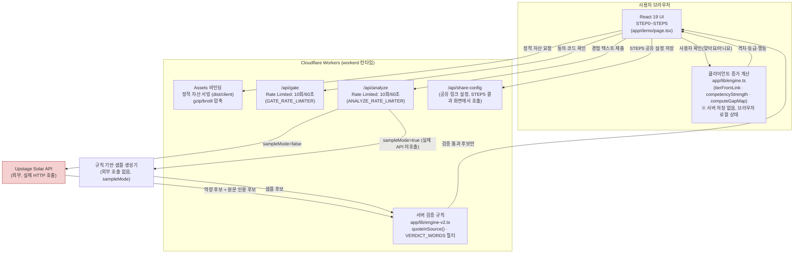
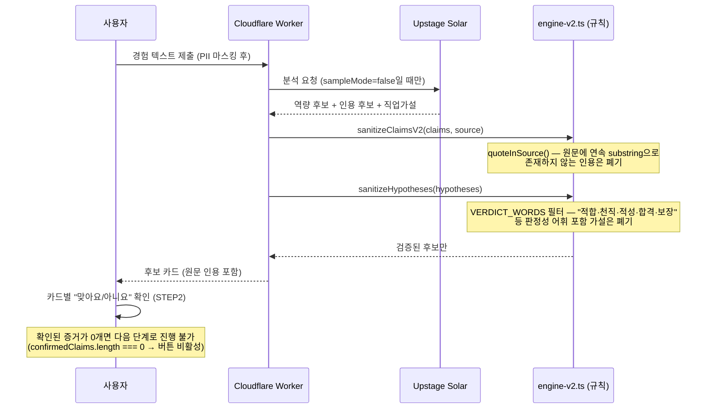

# GapProof 시스템 구조

**작성일**: 2026-07-28. 모든 컴포넌트·경로는 실제 코드(`app/`, `wrangler.jsonc`, `package.json`)를 직접 확인해 작성했다(`[코드 검증]`). 렌더링 도구(SVG/PNG 변환기)가 이 환경에 설치되어 있지 않아 Mermaid 원본만 제공한다 — 임의로 도구를 설치하지 않았다. Canva 도식화용 구성안은 §4에 별도로 정리했다.

## 1. 전체 구조 (Mermaid)

## 2. 데이터 신뢰 경계 (Mermaid)

Solar가 제안한 원문이 실제 화면에 도달하기까지 반드시 통과해야 하는 검증 순서. `app/lib/engine-v2.ts` 직접 확인.

## 3. 컴포넌트별 설명

| 컴포넌트 | 파일 | 역할 | 상태 |
|---|---|---|---|
| UI 플로우(STEP0~5) | `app/demo/page.tsx` | 경험 입력부터 결과 카드까지 전체 화면 상태 관리 | `[구현됨]` |
| 서버 검증 규칙 | `app/lib/engine-v2.ts`(`quoteInSource()` 48-52행) | Solar 제안을 원문·어휘 기준으로 필터링(신뢰 경계) | `[구현됨/테스트 확인]` |
| 클라이언트 증거 계산 | `app/lib/engine.ts` | 확인된 증거로 격차·등급 계산(서버 저장 없음) | `[구현됨]` — `competencyStrength`의 퀴즈→Lv.3 상향 로직은 CONFLICT 상태(§11 참고) |
| Rate Limiting | `wrangler.jsonc`의 `ratelimits` | `/api/gate`, `/api/analyze` 각 10회/60초 제한(엣지 차원) | `[구현됨]` |
| Assets 바인딩 | `wrangler.jsonc`의 `assets` | 정적 자산(`dist/client`) 압축 서빙, 운영과 로컬(`wrangler dev`) 동일 동작 | `[구현됨/테스트 확인]` |
| Images 바인딩 | `wrangler.jsonc`의 `images` | 이미지 처리(현재 화면 구성에서 핵심 경로는 아님) | `[구현됨]` |
| Solar 연동 | `/api/analyze` | 실제 API 호출, 응답에 `analysisSource: "solar"` 표기 | `[구현됨/운영 확인]` — 배지로 "Solar 실연결"과 "Solar 샘플 데모"를 명확히 구분 |

## 4. Canva 도식화 구성안 (SVG/PNG 렌더 도구 미설치 — 대체 지시)

이 환경에는 Mermaid를 SVG/PNG로 변환하는 CLI(`mmdc` 등)가 설치되어 있지 않다. 요구사항에 따라 임의로 설치하지 않고, 위 Mermaid 원본과 함께 Canva에서 직접 그릴 수 있는 구성안을 남긴다.

**슬라이드 1장 — "시스템 구조" (16:9)**:
- 좌측 세로 박스 3단: "사용자 브라우저"(React UI) → "Cloudflare Worker"(Assets + API + 규칙 검증) → "Upstage Solar"(외부, 빨간 테두리로 강조)
- 중앙에 화살표로 요청/응답 흐름 표시, "Rate Limited 10회/60초" 라벨을 API 박스 옆에 작게 배치
- 하단에 "규칙 검증(quoteInSource·VERDICT_WORDS)" 배지를 Worker 박스 안에 강조색으로 별도 표시 — 이것이 "AI가 자동 확정하지 않는다"는 핵심 메시지의 시각적 증거
- 색상: Cloudflare 계열(주황 #F38020)은 Worker 박스, Upstage 관련 배지는 중립색(외부 서비스임을 시각적으로 구분)

**슬라이드 2장 — "신뢰 경계"(시퀀스 다이어그램 단순화)**:
- 좌→우 4단 플로우: "사용자 입력" → "Solar 제안" → "규칙 검증(2단계)" → "사용자 최종 확인"
- 각 단계 사이에 X 표시로 "탈락 가능" 지점 표시(예: "원문에 없는 인용 → 폐기", "판정 어휘 포함 → 폐기")
- 마지막 단계 강조: "확정하는 사람은 AI가 아니라 사용자"

## 5. 정직한 한계

`competencyStrength()`(`app/lib/engine.ts:74`)가 산출물 없이 퀴즈 통과만으로 증거등급을 올리는 CONFLICT는 시스템 구조상 "클라이언트 증거 계산" 컴포넌트에 위치하며, `docs/planning/GAPPROOF_ALIGNMENT_AUDIT_2026-07-28.md`와 `docs/planning/GAPPROOF_NEXT_PR_SPEC.md`에 최우선 수정 대상으로 이미 명세되어 있다. 이 문서는 이를 숨기지 않고 §3 표에 명시한다.
